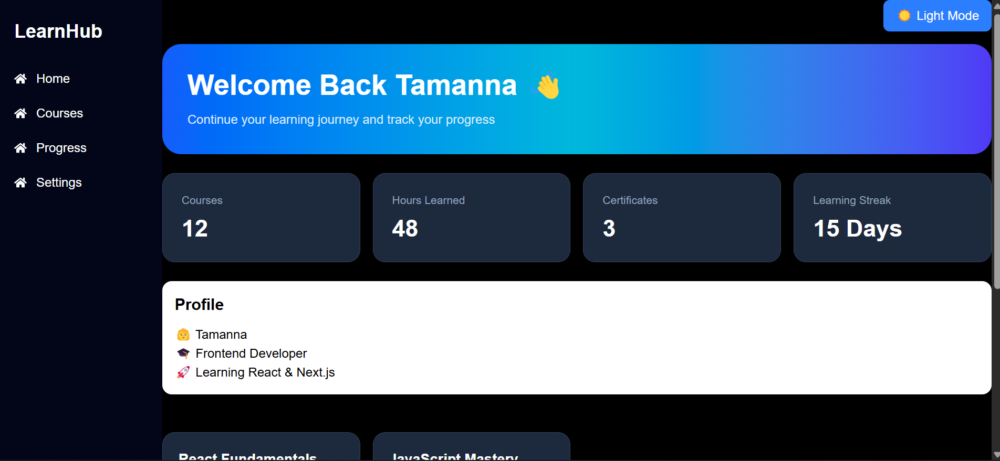
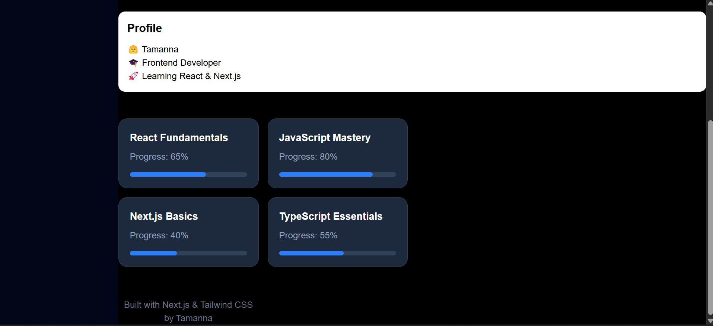

# LearnHub – Learning Dashboard

## Preview

## Overview
LearnHub is a responsive learning dashboard built using Next.js, React, TypeScript, Tailwind CSS, Framer Motion, and React Icons.

The dashboard helps users track their learning progress, courses, certificates, and recent activities through a modern and interactive interface.

## Features
- Responsive Sidebar Navigation
- Hero Section
- Statistics Cards
- Learning Progress Cards
- Profile Card
- Recent Activity Section
- Dark/Light Mode Toggle
- Responsive Design
- Framer Motion Animations

## Technologies Used
- Next.js
- React
- TypeScript
- Tailwind CSS
- Framer Motion
- React Icons
- GitHub
- Vercel

## Deployment

Live Demo:
https://learning-dashboard-six-ruby.vercel.app/

GitHub Repository:
https://github.com/tmna-19/learning-dashboard

## Future Enhancements
- User Authentication
- Backend Integration
- Database Support
- Course Management System
- Progress Analytics
